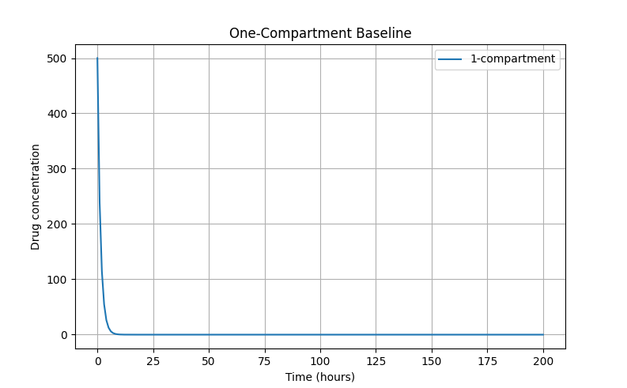
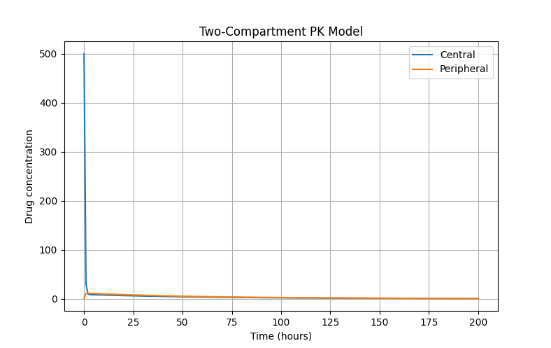

# Project 3: Pharmacokinetics
### Using models to determine how the human body processes drugs

---

## Table of Contents
1. [Project Overview](#1-project-overview)
2. [Background](#2-background)
   - [What is Pharmacokinetics?](#what-is-pharmacokinetics)  
   - [One vs Two-Compartment Models](#one-vs-two-compartment-models)  
   - [Why Amiodarone?](#why-amiodarone) 
3. [Method](#3-method)  
   - [Model Formulation](#model-formulation)  
   - [Numerical Simulation](#numerical-simulation)  
   - [Parameter Values](#parameter-values)  
4. [Code Structure](#4-code-structure)  
   - [File Overview](#file-overview)  
   - [File Details](#file-details)  
5. [Results](#5-results)  
6. [Comparison to Literature](#6-comparison-to-literature)  
7. [Sensitivity Analysis](#7-sensitivity-analysis)  
8. [Testing](#8-testing)  
9. [Limitations](#9-limitations)  
10. [Usage](#10-usage)  
11. [Dependencies](#11-dependencies)  
12. [References](#12-references)

---

## 1. Project Overview
This project models the pharmacokinetics of intravenous amiodarone using one- and two-compartment ordinary differential equation (ODE) models. The goal is to reproduce concentration-time behavior reported in the literature and evaluate model accuracy and robustness through simulation, validation, and sensitivity analysis.

The project focuses on:
- Building physically meaningful models  
- Solving ODEs numerically  
- Interpreting results in a biological context  

---

## 2. Background
### What is Pharmacokinetics?
Pharmacokinetics is the study of how a drug moves through the body over time. It focuses on processes such as **distribution** (how the drug spreads through tissues) and **elimination** (how the drug is removed). These processes are often summarized using compartment models, where the body is represented as one or more connected regions. By modeling these dynamics mathematically, we can predict how drug concentration changes after administration.
 

### One vs Two-Compartment Models
- **One-compartment model:** assumes uniform distribution across the body  
- **Two-compartment model:** separates the body into:
  - central compartment (blood/plasma)
  - peripheral compartment (tissue)

The two-compartment model captures:
- a rapid **distribution phase**
- a slower **elimination phase**

 

### Why Amiodarone?
Amiodarone is an antiarrhythmic drug used to treat irregular heart rhythms. It is known for having **complex pharmacokinetics**, including:
- extensive distribution into body tissues  
- a large apparent volume of distribution  
- slow elimination over time  

Because of these properties, amiodarone does not behave like a simple, uniformly distributed drug. Instead, it exhibits clear **multi-phase dynamics**, including a rapid distribution phase followed by a slower elimination phase. This makes it particularly well-suited for **two-compartment modeling**, where the drug moves between a central (blood) and peripheral (tissue) compartment.

As a result, amiodarone is frequently used in pharmacokinetic studies and provides a strong benchmark for comparing simulation results with published literature.

---

## 3. Method
### Model Formulation
The system is modeled using ODEs based on drug **amount (A)**:

Central compartment:
dAc/dt = -CL*(Ac/Vc) - Q*(Ac/Vc) + Q*(Ap/Vp)

Peripheral compartment:
dAp/dt = Q*(Ac/Vc) - Q*(Ap/Vp)

Concentration is computed as:
C = A / V

This formulation aligns with standard pharmacokinetic modeling practices.

 

### Numerical Simulation
The system is solved using `scipy.integrate.solve_ivp`.

Simulation setup:
- fixed time interval  
- evenly spaced time points  
- initial condition represents a single IV dose  

 

### Parameter Values
| Parameter | Value | Description |
|----------|------|------------|
| CL | 0.22 | Clearance |
| Vc | 0.30 | Central volume |
| Vp | 10.0 | Peripheral volume |
| Q  | 0.71 | Inter-compartmental transfer |

---

## 4. Code Structure
### File Details
pharmacokinetics/
│
├── src/
│   ├── constants.py          - model parameters and simulation settings 
│   ├── models.py             - contains the ODE definitions
│   ├── simulation.py         - acts as the numerical solver 
│   ├── plotting.py           - gives out the visualization of results 
│   ├── validation.py         - RMSE and error metrics 
│   ├── sensitivity.py        - parameter variation analysis  
│   └── main.py               - runs the full workflow  
│   
├── tests/
│   ├── test_models.py        - 
│   ├── test_sensitivity.py   -       
│   ├── test_simulation.py    - 
│   └── test_validation.py    -  
│
├── pytest.ini
├── requirements.txt
└── README.md

---

## 5. Results
### One-Compartment Model

- Produces exponential decay  
- Serves as a baseline sanity check

 

### Two-Compartment Model

- Rapid initial drop (distribution phase)  
- Slower long-term decay (elimination phase)  
- Peripheral compartment shows delayed increase  

---

## 6. Comparison to Literature
### Agreement
### Differences
### Interpretation

## 7. Sensitivity Analysis
### Observations
### Interpretation

## 8. Testing

## 9. Limitations

## 10. Usage

## 11. Dependencies

## 12. References
