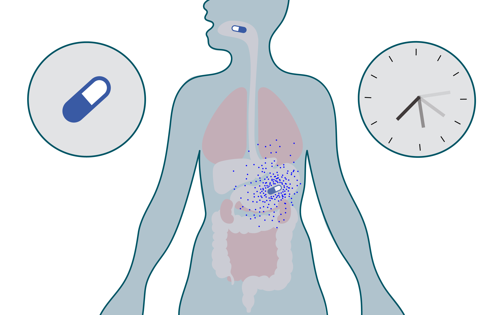

# Project 3: Pharmacokinetics
### Using models to determine how the human body processes drugs

---

## Table of Contents
1. [Project Overview](#1-project-overview)
2. [Background](#2-background)
   - [What is Pharmacokinetics?](#what-is-pharmacokinetics)  
   - [One vs Two-Compartment Models](#one-vs-two-compartment-models)  
   - [Why Amiodarone?](#why-amiodarone) 
3. [Method](#3-method)  
   - [Model Formulation](#model-formulation)  
   - [Numerical Simulation](#numerical-simulation)  
   - [Parameter Values](#parameter-values)  
4. [Code Structure](#4-code-structure)  
   - [File Overview](#file-overview)  
   - [File Details](#file-details)  
5. [Results](#5-results)  
6. [Comparison to Literature](#6-comparison-to-literature)  
7. [Sensitivity Analysis](#7-sensitivity-analysis)  
8. [Limitations](#8-limitations)  
9. [Usage](#9-usage)  
10. [Dependencies](#10-dependencies)  
11. [References](#11-references)

---

## 1. Project Overview

## 2. Background
### What is Pharmacokinetics?
### One vs Two-Compartment Models
### Why Amiodarone?

## 3. Method
### Model Formulation
### Numerical Simulation

## 4. Code Structure
### File Details

## 5. Results
### One-Compartment Model
### Two-Compartment Model

## 6. Comparison to Literature
### Agreement
### Differences
### Interpretation

## 7. Sensitivity Analysis
### Observations
### Interpretation

## 8. Limitations

## 9. Usage

# 10. Dependencies

# 11. References
